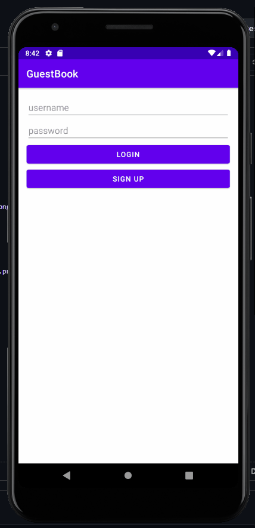
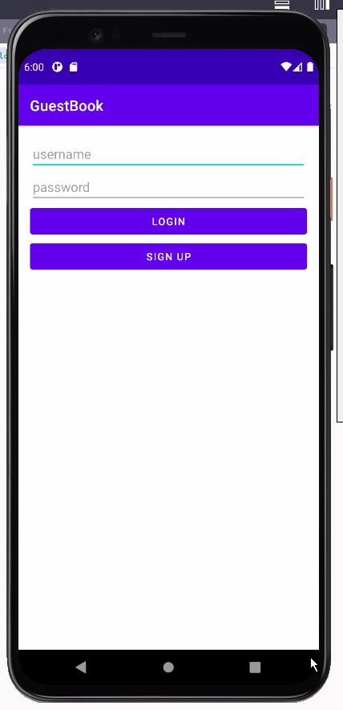
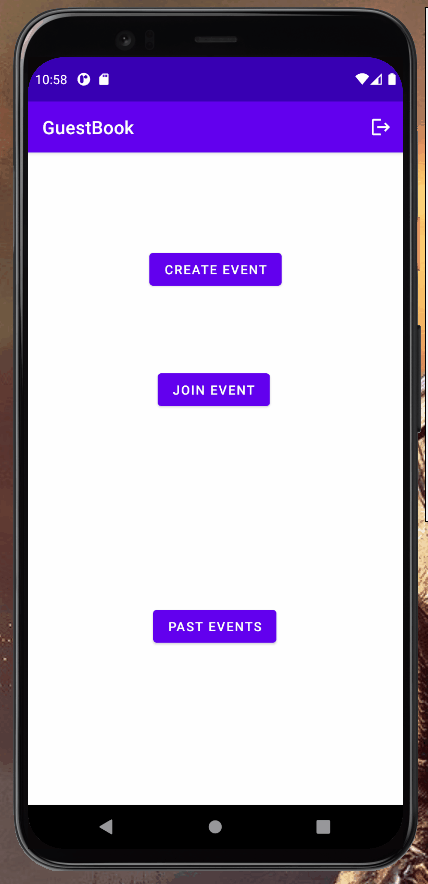
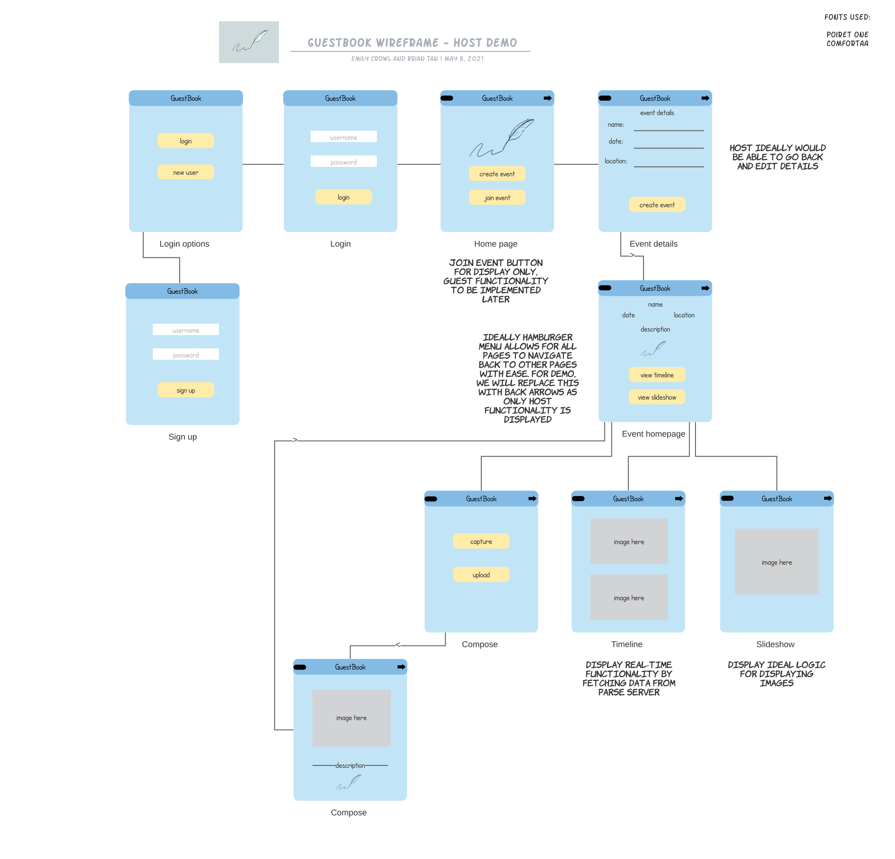

Original App Design Project - README
===

# GuestBook

## Table of Contents
1. [Overview](#Overview)
1. [Product Spec](#Product-Spec)
1. [Wireframes](#Wireframes)
2. [Schema](#Schema)

## Overview
### Description
This application acts as a digital guestbook for event such as weddings, baby showers, birthday parties and more.
Users will be able to either create an event or sign up for an event. Within these events, users can upload photos,
videos, and text that will be displayed to the event's timeline.

### App Evaluation
- **Category:** Social Media
- **Mobile:** Mobile allows for convenient use of this app. Users will be able to use the camera to take pictures
	      of the event they are at as well as easily upload any photos/videos from their phone. They can also use
	      the map feature to "tag" locations.
- **Story:** Allows for a digitalized, mobile, and compact guestbook that can be easily accessed from anywhere by the
             desired party.
- **Market:** Any person hosting an event who wishes to keep a guestbook. Especially marketed towards weddings and 
              baby showers.
- **Habit:** Event hosts can easily set this up for their events and guests can access the events at any time to upoad content.
- **Scope:** V1 would allow users to create an account and create an event with uploading capabilities. V2 would allow for users to
             see the event timelines. V3 would allow for multiple event timelines and capabilities for multiple users to "sign into" an event.

## Product Spec

### 1. User Stories (Required and Optional)

**Required Must-have Stories**

* User can login
* User can create a new account
* User can create an event
* User can edit event details
* User can post a picture/video/text message
* User can view a feed of media

**Optional Nice-to-have Stories**

* Users can join an active event
* Users can view past events

### 2. Screen Archetypes

* Login Screen
   * User can login
* Account Registration Screen
   * User can create a new account
* Home Screen
   * Lists event creation and event registration options
* Event Creation Screen
   * User can create a new event
   * User can input event details
* Event Registration Screen
   * User can register for an event
* Event Stream
   * User can view a feed of photos/videos/text
   * User can see tagged locations for media
* Creation
   * User can post a photo/video/text message
* Past Events
   * User can view past event guestbooks

### 3. Navigation

**Tab Navigation** (Tab to Screen)

* Home
* Past Events
* Logout

**Flow Navigation** (Screen to Screen)

* Login Screen
   => Home
* Registration Screen
   => Home
* Home Screen
   => Login Screen
   => Create Event
   => Join Event
   => Past Events
* Timeline
   => Home Screen
   => Edit Details
* Creation
   => Timeline
* Edit Details/Create Event
   => Home
   => Timeline
* Event Registration
   => Home
   => Timeline
* Past Events
   => Home
   => Timeline

## Wireframes

## Schema 
### Models

### Networking
List of network requests by screen
- Timeline Feed Screen
  - (Read/GET) Query all posts where event is author
  
- Creation Screen
  - (Create/POST) Create a new post object
- Edit Details Screen
  - (Read/GET) Query logged in event object
  - (Update/PUT) Update event time, date, name. 
- Join Event Screen
   - (Read/GET) Query logged in event object

## MILESTONE 1
- [X] Create Parse server
- [ ] Login
   - Mostly completed. Need to do some debugging which will be completed by next milestone.
- [ ] Create new account
   - Mostly completed. Need to do some debugging which will be completed by next milestone.
- [ ] Post
   - Moved to next Milestone

### Issues
- Toasts are not working (will be solved by next Milestone)
- No navigation to MainActivity (will be solved by next Milestone)
- New users are not showing up in Parse database (will be solved by next Milestone)
   

## MILESTONE 2
- [X] Login
- [X] Create new account
- [ ] Post
   - .xml created, working on connecting it to other activities 
- [ ] Create event
   - .xml and logic generated, passes info to TimelineActivity; working on UI/UX on Timeline Activity
- [ ] Timeline
   - Need to finish Post step before we can populate Timeline
- [ ] Edit event details
   - No navigation back to Edit Details yet, will need to create an adapter

### Issues
- Some text on Edit Details page won't allow user input
   

## MILESTONE 3
- [X] Post
- [X] Create event
- [ ] Timeline
   - Working on logic for this now. Changed direction of this story a bit, pushing this issue to the last milestone.
- [ ] Edit event details
   - Removing this as a required feature for now.

### Issues
- No actual issues. Updated the concept for the TimelineActivity to incorporate a real-time slideshow instead of a scrolling feature.
- Since we are changing the direction of the app a little bit, the navigation is not finished yet.

### Looking Ahead
- Working on finalizing UI/UX which will be fully incorporated by next Milestone
   

## MILESTONE 4
- [X] Timeline
- [X] Sign into events
- [X] Polish UI/UX

### Issues
- Issues with implementing slideshow feature.

### Updated Wireframe (Ideal Design)

   

